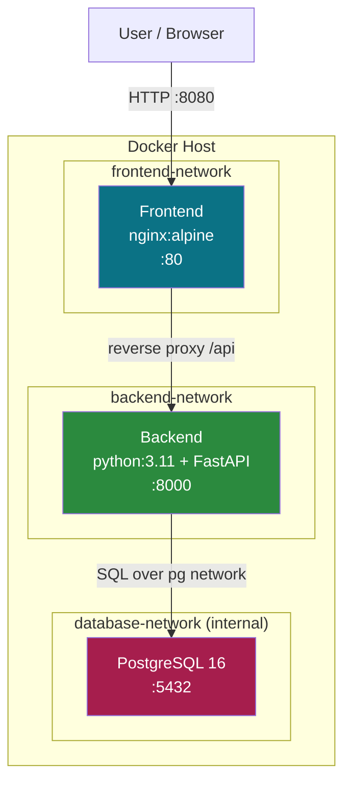
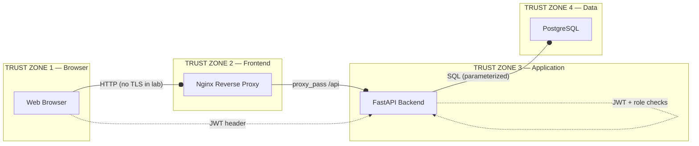
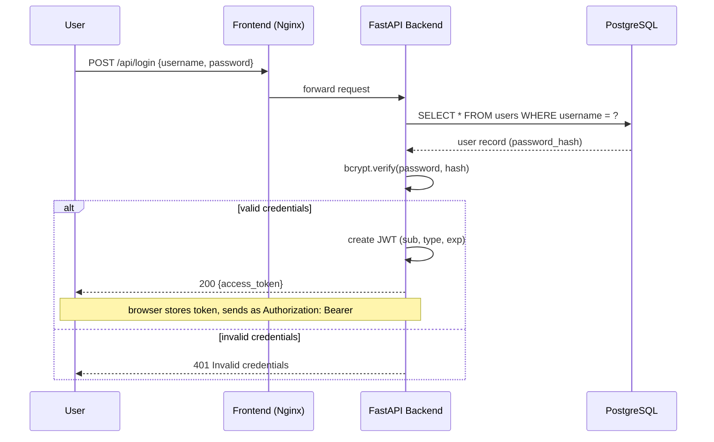
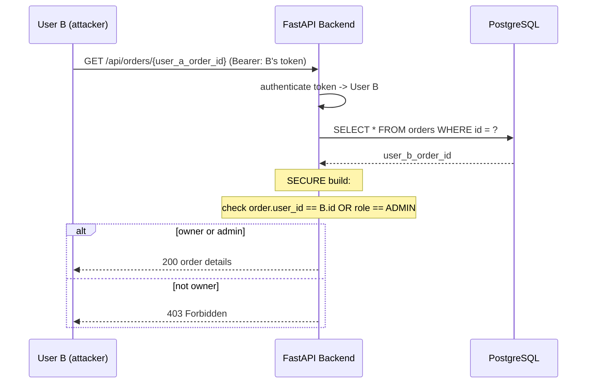
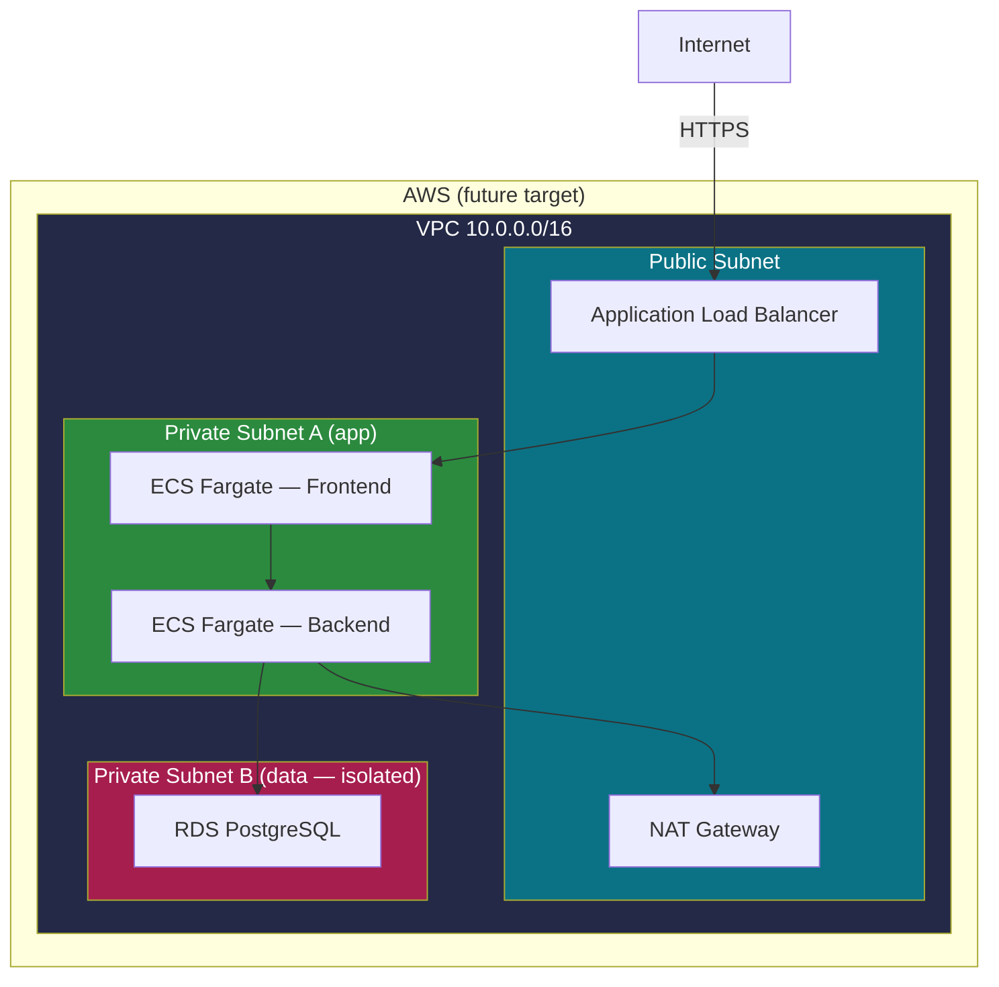

# Architecture Diagrams

All diagrams render natively on GitHub (Mermaid). Each diagram below is also
reproduced in the documentation it belongs to.

---

## 1. System Architecture & Network Segmentation

---

## 2. Trust Boundaries

---

## 3. Authentication Flow

---

## 4. Order Authorization Flow (BOLA / IDOR)

---

## 5. AWS Target Architecture

